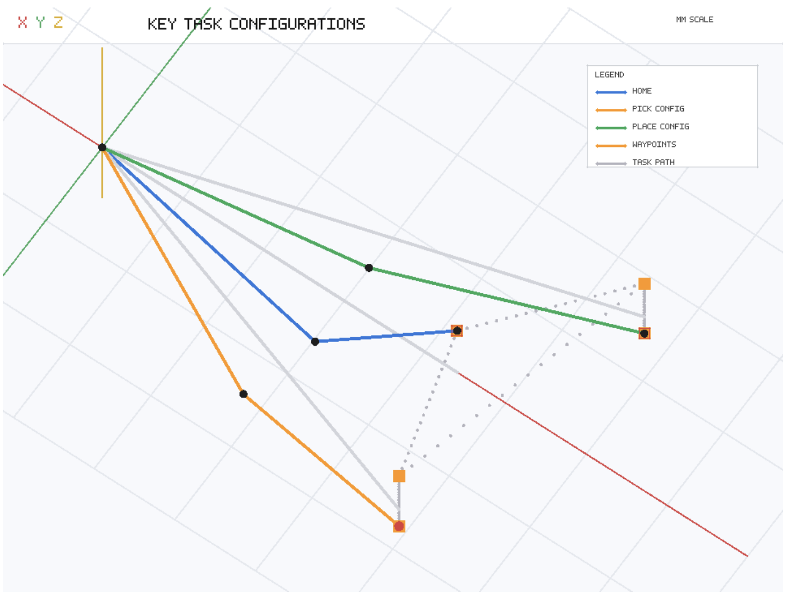
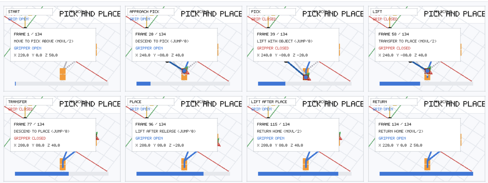

## Project Overview

The aim of this project is to control a 4-axis robot arm to perform a simple pick-and-place operation. The robot moves from a home position to a target object, picks it up using the end effector, transfers it to a selected drop-off location, and then returns to its starting position.

This project was created as a practical introduction to robotic arm control, motion sequencing, coordinate-based movement, and automation logic.

## Demo
[Robot in action](MagicianLite.mp4)

## Main Features

- 4-axis robotic arm movement control
- Predefined pick-up and drop-off positions
- Basic motion sequencing
- End-effector control for gripping/releasing objects
- Repeatable pick-and-place routine
- Simple task automation using a desktop-controlled robot arm

## Task Workflow

1. Move the robot arm to the home position
2. Move above the target object
3. Lower the arm to the pick-up position
4. Activate the gripper
5. Lift the object
6. Move to the drop-off position
7. Release the object
8. Return to the home position

